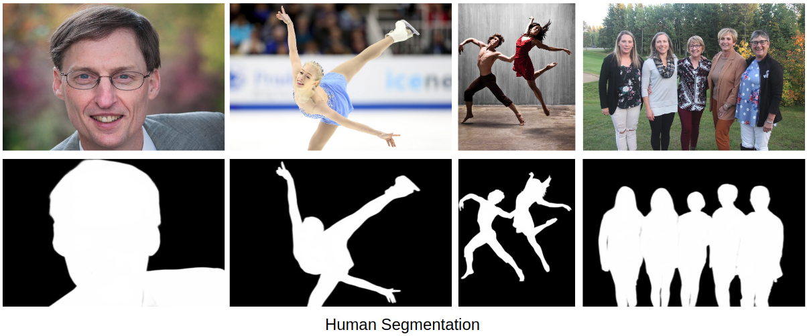

# U^2-Net (U square net)

# Paper

[U^2-Net: Going Deeper with Nested U-Structure for Salient Object Detection](https://arxiv.org/pdf/2005.09007.pdf)

## Authors

[Xuebin Qin](https://webdocs.cs.ualberta.ca/~xuebin/), <br/>
[Zichen Zhang](https://webdocs.cs.ualberta.ca/~zichen2/), <br/>
[Chenyang Huang](https://chenyangh.com/), <br/>
[Masood Dehghan](https://sites.google.com/view/masooddehghan), <br/>
[Osmar R. Zaiane](http://webdocs.cs.ualberta.ca/~zaiane/) and <br/>
[Martin Jagersand](https://webdocs.cs.ualberta.ca/~jag/).

## Original Repo

https://github.com/xuebinqin/U-2-Net

(1) To run the human segmentation model, please first downlowd the [**u2net_human_seg.pth**](https://drive.google.com/file/d/1-Yg0cxgrNhHP-016FPdp902BR-kSsA4P/view?usp=sharing) model weights into ``` ./saved_models/u2net_human_seg/```. <br/>
(2) Prepare the to-be-segmented images into the corresponding directory, e.g. ```./test_data/test_human_images/```. <br/>
(3) Run the inference by command: ```python u2net_human_seg_test.py``` and the results will be output into the corresponding dirctory, e.g. ```./test_data/u2net_test_human_images_results/```<br/>
[**Notes: Due to the labeling accuracy of the Supervisely Person Dataset, the human segmentation model (u2net_human_seg.pth) here won't give you hair-level accuracy. But it should be more robust than u2net trained with DUTS-TR dataset on general human segmentation task. It can be used for human portrait segmentation, human body segmentation, etc.**](https://github.com/NathanUA/U-2-Net)<br/>

 <br/>

## Required libraries

Python 3.6  
numpy 1.15.2  
scikit-image 0.14.0  
python-opencv
PIL 5.2.0  
PyTorch 0.4.0  
torchvision 0.2.1  
glob  

## Citation
```
@InProceedings{Qin_2020_PR,
title = {U2-Net: Going Deeper with Nested U-Structure for Salient Object Detection},
author = {Qin, Xuebin and Zhang, Zichen and Huang, Chenyang and Dehghan, Masood and Zaiane, Osmar and Jagersand, Martin},
journal = {Pattern Recognition},
volume = {106},
pages = {107404},
year = {2020}
}
```
